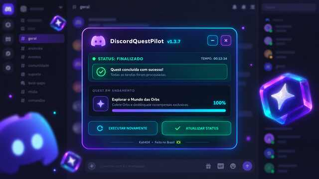
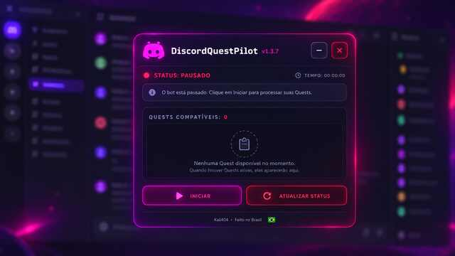

<!-- DiscordQuestPilot • Kali404 -->

<div align="center">


<p>
  
  
  
</p>

</div>


## ✦ Visão geral

O **DiscordQuestPilot** é um conceito de painel flutuante com interface em glassmorphism, criado para organizar visualmente informações de missões, estado da sessão e progresso em uma única tela.

<div align="center">


</div>

```ts
const projeto = {
  nome: "DiscordQuestPilot",
  criador: "Kali404",
  origem: "Brasil 🇧🇷",
  identidade: "Glassmorphism + Neon",
  foco: "Experiência visual para acompanhamento de missões"
};
```

## ⚡ Destaques

| Recurso | Descrição |
| :-- | :-- |
| 🪟 Painel flutuante | Interface compacta e organizada sobre o Discord |
| ✨ Glassmorphism | Transparência, gradientes e acabamento neon |
| 📊 Indicadores | Estado da sessão, tempo e progresso visual |
| 🎛️ Controles de UI | Janela arrastável, minimizável e ocultável |
| 🇧🇷 Assinatura | Criado por **Kali404**, feito no Brasil |

## 🖼️ Galeria

<div align="center">

> Adicione as imagens finais na pasta `assets/` usando estes nomes:

| Painel ativo | Painel finalizado |
| :--: | :--: |
|  |  |



</div>

## 🗂️ Estrutura

```text
DiscordQuestPilot/
├── README.md
├── LICENSE
├── assets/
│   ├── preview-01.png
│   ├── preview-02.png
│   └── preview-03.png
└── src/
    └── DiscordQuestPilot.js
```

> O arquivo principal do projeto deve ficar em `src/DiscordQuestPilot.js`.

## 📦 Código do projeto

<details>
<summary><b>▸ Clique para expandir</b></summary>
<br>

/*
 * ==========================================================================
 * DiscordQuestPilot - v1.3.7 (Community Edition)
 * ==========================================================================
 * 
 * Desenvolvido por: Kali 404
 * Descrição: Script de automação avançada para Discord Quests com UI 
 *            flutuante em Glassmorphism injetada no DOM.
 * 
 * Este projeto é de código aberto e foi criado para ajudar a comunidade.
 * O uso deste software é por conta e risco do usuário, não tendo afiliação 
 * com a Discord Inc.
 * ==========================================================================
 */

(function initDiscordQuestPilot() {
    const oldWrap = document.getElementById('panelWrap');
    if (oldWrap) oldWrap.remove();
    const oldStyle = document.getElementById('dqp-style-injected');
    if (oldStyle) oldStyle.remove();

    // ==========================================
    // 1. INJEÇÃO DA INTERFACE (UI) E CSS
    // ==========================================
    const style = document.createElement('style');
    style.id = 'dqp-style-injected';
    style.innerHTML = `
        #panelWrap * { box-sizing: border-box; margin: 0; padding: 0; }
        #panelWrap { position: fixed; right: 24px; bottom: 24px; width: min(420px, calc(100vw - 32px)); z-index: 2147483647; font-family: "gg sans", "Noto Sans", "Helvetica Neue", Helvetica, Arial, sans-serif; color: #f7f5ff; }
        #panelWrap .panel { position: relative; padding: 1.5px; border-radius: 20px; background: radial-gradient(circle at 100% 0%, rgba(0, 200, 255, .12), transparent 45%), radial-gradient(circle at 0% 100%, rgba(168, 85, 247, .12), transparent 45%), linear-gradient(160deg, rgba(18, 16, 32, .97), rgba(7, 6, 14, .99)); box-shadow: 0 30px 80px rgba(0, 0, 0, .65), 0 0 40px rgba(0, 220, 255, .18), 0 0 80px rgba(140, 40, 255, .14); backdrop-filter: blur(22px); -webkit-backdrop-filter: blur(22px); overflow: hidden; }
        #panelWrap .panel::before { content: ""; position: absolute; inset: 0; border-radius: inherit; padding: 1.5px; background: linear-gradient(135deg, #a855f7 0%, #7c3aed 22%, #13d8ff 55%, #00efa0 85%, #13d8ff 100%); -webkit-mask: linear-gradient(#000 0 0) content-box, linear-gradient(#000 0 0); -webkit-mask-composite: xor; mask-composite: exclude; pointer-events: none; z-index: 3; }
        #panelWrap .panel::after { content: ""; position: absolute; inset: -2px; border-radius: 22px; background: linear-gradient(135deg, #a855f7, #13d8ff, #00efa0); filter: blur(18px); opacity: .22; z-index: 0; pointer-events: none; }
        #panelWrap .panel-inner { position: relative; z-index: 2; border-radius: 18px; background: transparent; }
        #panelWrap .header { display: flex; align-items: center; gap: 12px; padding: 14px 16px; border-bottom: 1px solid rgba(255, 255, 255, .07); cursor: grab; user-select: none; }
        #panelWrap .header:active { cursor: grabbing; }
        #panelWrap .brand-icon { width: 46px; height: 46px; flex: 0 0 46px; display: grid; place-items: center; }
        #panelWrap .brand-icon svg { width: 85%; height: 85%; filter: drop-shadow(0 0 6px rgba(168, 85, 247, 0.6)); }
        #panelWrap .brand-copy { flex: 1; min-width: 0; }
        #panelWrap .title { font-family: Consolas, "Courier New", monospace; font-size: 15px; font-weight: 700; letter-spacing: .02em; color: #fff; display: flex; align-items: baseline; gap: 6px; white-space: nowrap; }
        #panelWrap .title .version { color: #00ffff; font-size: 11px; font-weight: 700; font-family: "gg sans", "Noto Sans", sans-serif; text-shadow: 0 0 5px rgba(0, 255, 255, 0.8), 0 0 10px rgba(0, 255, 255, 0.5); letter-spacing: 0.5px; }
        #panelWrap .header-actions { display: flex; gap: 6px; }
        #panelWrap .icon-btn { width: 30px; height: 30px; display: grid; place-items: center; border-radius: 9px; background: rgba(255, 255, 255, .03); font: 700 16px/1 "gg sans", "Noto Sans", sans-serif; cursor: pointer; transition: all .18s ease; }
        #panelWrap .icon-btn.min { color: #ffd84a; border: 1px solid rgba(255, 216, 74, .55); box-shadow: 0 0 10px rgba(255, 216, 74, .25), inset 0 0 6px rgba(255, 216, 74, .08); }
        #panelWrap .icon-btn.min:hover { color: #fff2b0; border-color: #ffd84a; background: rgba(255, 216, 74, .14); box-shadow: 0 0 18px rgba(255, 216, 74, .55); transform: translateY(-1px); }
        #panelWrap .icon-btn.close { color: #ff4d67; border: 1px solid rgba(255, 77, 103, .55); box-shadow: 0 0 10px rgba(255, 77, 103, .25), inset 0 0 6px rgba(255, 77, 103, .08); }
        #panelWrap .icon-btn.close:hover { color: #ffb0bc; border-color: #ff4d67; background: rgba(255, 77, 103, .14); box-shadow: 0 0 18px rgba(255, 77, 103, .6); transform: translateY(-1px); }
        #panelWrap .body { display: grid; gap: 14px; padding: 16px; }
        #panelWrap .status-row { display: flex; align-items: center; justify-content: space-between; gap: 12px; font-size: 11px; font-weight: 700; letter-spacing: .06em; text-transform: uppercase; }
        #panelWrap .status-label { display: flex; align-items: center; gap: 8px; color: #00efa0; }
        #panelWrap .pulse { width: 8px; height: 8px; border-radius: 50%; background: #00efa0; box-shadow: 0 0 10px #00efa0; animation: dqp-pulse 1.5s ease-in-out infinite; }
        @keyframes dqp-pulse { 0%, 100% { opacity: 1; transform: scale(1); } 50% { opacity: .5; transform: scale(.8); } }
        #panelWrap .status-timer { color: #b8b4c4; font-weight: 700; letter-spacing: .06em; font-variant-numeric: tabular-nums; }
        #panelWrap .status-timer span { color: #13d8ff; }
        #panelWrap .status-sub { display: flex; align-items: center; gap: 8px; padding: 10px 12px; border-radius: 10px; background: rgba(0, 200, 255, .05); border: 1px solid rgba(19, 216, 255, .14); font-size: 12px; font-weight: 500; color: #c5e8f5; margin-top: -6px; }
        #panelWrap .status-sub .dot { width: 7px; height: 7px; border-radius: 50%; background: #00efa0; box-shadow: 0 0 8px #00efa0; flex: 0 0 auto; }
        #panelWrap .quests-card { padding: 14px; border: 1px solid rgba(155, 92, 255, .22); border-radius: 14px; background: linear-gradient(160deg, rgba(20, 16, 34, .7), rgba(10, 8, 20, .8)); box-shadow: inset 0 1px 0 rgba(255, 255, 255, .04); }
        #panelWrap .section-label { font-size: 10px; font-weight: 800; letter-spacing: .14em; text-transform: uppercase; color: #8a8696; margin-bottom: 10px; }
        #panelWrap .section-label .count { color: #13d8ff; margin-left: 4px; }
        #panelWrap .quests-list { display: grid; gap: 12px; max-height: 220px; overflow-y: auto; scrollbar-width: thin; scrollbar-color: rgba(147, 51, 234, .5) transparent; }
        #panelWrap .quests-list::-webkit-scrollbar { width: 6px; }
        #panelWrap .quests-list::-webkit-scrollbar-thumb { background: rgba(147, 51, 234, .4); border-radius: 999px; }
        #panelWrap .quest-item { display: grid; grid-template-columns: 24px 1fr auto; grid-template-rows: auto auto; column-gap: 10px; row-gap: 6px; align-items: center; }
        #panelWrap .quest-icon { grid-row: 1 / 2; width: 24px; height: 24px; display: grid; place-items: center; border-radius: 7px; background: rgba(19, 216, 255, .1); border: 1px solid rgba(19, 216, 255, .22); color: #13d8ff; font-size: 12px; }
        #panelWrap .quest-name { grid-row: 1 / 2; font-size: 12.5px; font-weight: 600; color: #e8e5f0; white-space: nowrap; overflow: hidden; text-overflow: ellipsis; }
        #panelWrap .quest-time { grid-row: 1 / 2; font-size: 11px; font-weight: 600; color: #8a8696; font-variant-numeric: tabular-nums; }
        #panelWrap .quest-bar { grid-column: 1 / -1; grid-row: 2 / 3; height: 4px; border-radius: 999px; background: rgba(255, 255, 255, .06); overflow: hidden; margin-left: 34px; }
        #panelWrap .quest-bar-fill { height: 100%; border-radius: inherit; background: linear-gradient(90deg, #13d8ff, #a855f7); box-shadow: 0 0 10px rgba(19, 216, 255, .55); transition: width .5s cubic-bezier(.2,.8,.2,1); }
        #panelWrap .actions { display: grid; grid-template-columns: 1fr 1fr; gap: 10px; }
        #panelWrap .action-btn { min-height: 46px; border-radius: 11px; font-family: Consolas, "Courier New", monospace; font-size: 12px; font-weight: 700; letter-spacing: .06em; text-transform: uppercase; cursor: pointer; transition: all .2s ease; display: grid; place-items: center; }
        #panelWrap .action-btn.primary { border: 1px solid rgba(168, 85, 247, .55); background: linear-gradient(135deg, rgba(124, 33, 232, .28), rgba(19, 216, 255, .14)); color: #fff; box-shadow: inset 0 1px 0 rgba(255, 255, 255, .1), 0 0 20px rgba(140, 38, 255, .2); }
        #panelWrap .action-btn.primary:hover { filter: brightness(1.2); box-shadow: inset 0 1px 0 rgba(255, 255, 255, .15), 0 0 28px rgba(168, 85, 247, .4); }
        #panelWrap .action-btn.start-mode { border: 1px solid rgba(0, 239, 160, .55); background: linear-gradient(135deg, rgba(0, 239, 160, .28), rgba(19, 216, 255, .14)); box-shadow: inset 0 1px 0 rgba(255, 255, 255, .1), 0 0 20px rgba(0, 239, 160, .2); color: #00efa0 !important; }
        #panelWrap .action-btn.start-mode:hover { box-shadow: inset 0 1px 0 rgba(255, 255, 255, .15), 0 0 28px rgba(0, 239, 160, .4); filter: brightness(1.2); }
        #panelWrap .action-btn.secondary { border: 1px solid rgba(19, 216, 255, .38); background: rgba(19, 216, 255, .06); color: #13d8ff; }
        #panelWrap .action-btn.secondary:hover { background: rgba(19, 216, 255, .12); box-shadow: 0 0 22px rgba(19, 216, 255, .25); }
        #panelWrap .action-btn:active { transform: scale(.98); }
        #panelWrap .panel-footer { display: flex; justify-content: space-between; align-items: center; padding: 12px 16px; border-top: 1px solid rgba(255, 255, 255, .06); font-size: 10.5px; color: #6f6b7c; font-weight: 500; }
        #panelWrap .credit-name { color: #00ff88; font-weight: 800; letter-spacing: .04em; text-shadow: 0 0 4px rgba(0, 255, 136, .9), 0 0 10px rgba(0, 255, 136, .6), 0 0 20px rgba(0, 255, 136, .35); animation: glow-green 2.4s ease-in-out infinite; }
        @keyframes glow-green { 0%, 100% { text-shadow: 0 0 4px rgba(0, 255, 136, .9), 0 0 10px rgba(0, 255, 136, .6), 0 0 20px rgba(0, 255, 136, .35); } 50% { text-shadow: 0 0 6px rgba(0, 255, 136, 1), 0 0 16px rgba(0, 255, 136, .85), 0 0 32px rgba(0, 255, 136, .55); } }
        #panelWrap .panel-footer .right { color: #b8b4c4; display: inline-flex; align-items: center; gap: 6px; }
        #panelWrap .flag-br { display: inline-block; width: 16px; height: 11px; border-radius: 2px; box-shadow: 0 0 0 1px rgba(255, 255, 255, .1); vertical-align: -1px; }
        #panelWrap .panel.minimized .body, #panelWrap .panel.minimized .panel-footer { display: none; }
        #panelWrap.hidden .panel { display: none; }
        #panelWrap .restore-btn { display: none; width: 56px; height: 56px; place-items: center; border: 1.5px solid rgba(168, 85, 247, .55); border-radius: 18px; background: linear-gradient(135deg, #0d0a1a, #050409); box-shadow: 0 12px 36px rgba(0, 0, 0, .6), 0 0 24px rgba(140, 40, 255, .25); cursor: pointer; transition: all .2s ease; }
        #panelWrap .restore-btn:hover { transform: translateY(-2px); filter: brightness(1.15); }
        #panelWrap .restore-btn svg { width: 26px; height: 26px; }
        #panelWrap.hidden .restore-btn { display: grid; }
    `;
    document.head.appendChild(style);

    const wrap = document.createElement('div');
    wrap.id = 'panelWrap';
    wrap.innerHTML = `
        <section class="panel" id="panel">
            <div class="panel-inner">
                <header class="header" id="header">
                    <div class="brand-icon">
                        <svg viewBox="0 0 127.14 96.36" xmlns="http://www.w3.org/2000/svg">
                            <path d="M107.7,8.07A105.15,105.15,0,0,0,81.47,0a72.06,72.06,0,0,0-3.36,6.83A97.68,97.68,0,0,0,49,6.83,72.37,72.37,0,0,0,45.64,0,105.89,105.89,0,0,0,19.39,8.09C2.79,32.65-1.71,56.6.54,80.21h0A105.73,105.73,0,0,0,32.71,96.36,77.7,77.7,0,0,0,39.6,85.25a68.42,68.42,0,0,1-10.85-5.18c.91-.66,1.8-1.34,2.66-2a75.57,75.57,0,0,0,64.32,0c.87.71,1.76,1.39,2.66,2a67.58,67.58,0,0,1-10.87,5.19,77,77,0,0,0,6.89,11.1,105.25,105.25,0,0,0,32.19-16.14c2.64-27.38-4.51-51.11-19.32-72.15ZM42.68,65.33C38,65.33,34.17,61,34.17,55.7s3.75-9.64,8.51-9.64,8.56,4.39,8.51,9.64C51.19,61,47.43,65.33,42.68,65.33Zm41.72,0c-4.73,0-8.51-4.33-8.51-9.64s3.75-9.64,8.51-9.64,8.56,4.39,8.51,9.64C84.4,61,80.64,65.33,84.4,65.33Z" fill="#9b59b6"/>
                        </svg>
                    </div>
                    <div class="brand-copy">
                        <div class="title">DiscordQuestPilot <span class="version">v1.3.7</span></div>
                    </div>
                    <div class="header-actions">
                        <button class="icon-btn min" id="btnMin" title="Recolher">−</button>
                        <button class="icon-btn close" id="btnClose" title="Ocultar">×</button>
                    </div>
                </header>
                <div class="body">
                    <div class="status-row">
                        <div class="status-label"><span class="pulse" id="statusPulse"></span> <span id="statusText">STATUS: INICIANDO...</span></div>
                        <div class="status-timer">TEMPO: <span id="elapsed">00:00:00</span></div>
                    </div>
                    <div class="status-sub">
                        <span class="dot" id="taskDot"></span>
                        <span id="currentTask">Iniciando scripts internos...</span>
                    </div>
                    <div class="quests-card">
                        <div class="section-label">QUESTS COMPATÍVEIS: <span class="count" id="questCount">0</span></div>
                        <div class="quests-list" id="questsList"></div>
                    </div>
                    <div class="actions">
                        <button class="action-btn primary" id="btnToggle">PARAR MISSÃO</button>
                        <button class="action-btn secondary" id="btnConf">ATUALIZAR STATUS</button>
                    </div>
                </div>
                <footer class="panel-footer">
                    <span>Criado por <span class="credit-name">Kali 404</span></span>
                    <span class="right">Feito no Brasil
                        <svg class="flag-br" viewBox="0 0 720 504" aria-label="Bandeira do Brasil" role="img">
                            <rect width="720" height="504" fill="#009c3b"/>
                            <polygon points="360,42 690,252 360,462 30,252" fill="#ffdf00"/>
                            <circle cx="360" cy="252" r="126" fill="#002776"/>
                            <path d="M234 252a126 126 0 0 1 252 0c0 12-1 24-4 35-70-40-176-55-244-35-3-11-4-23-4-35z" fill="#fff"/>
                        </svg>
                    </span>
                </footer>
            </div>
        </section>
        <button class="restore-btn" id="btnRestore" title="Mostrar painel">
            <svg viewBox="0 0 24 24" fill="none">
                <rect x="4" y="4" width="16" height="16" rx="4" fill="url(#g1)"/>
                <rect x="9" y="9" width="6" height="6" rx="1.5" fill="#0d0a1a"/>
                <defs><linearGradient id="g1" x1="0" y1="0" x2="1" y2="1"><stop offset="0" stop-color="#a855f7"/><stop offset="1" stop-color="#13d8ff"/></linearGradient></defs>
            </svg>
        </button>
    `;
    document.body.appendChild(wrap);

    // ==========================================
    // 2. LÓGICA DO DISCORD (CORE SCRIPT)
    // ==========================================
    let wpRequire = window.webpackChunkdiscord_app.push([[Symbol()], {}, r => r]);
    window.webpackChunkdiscord_app.pop();

    let ApplicationStreamingStore = Object.values(wpRequire.c).find(x => x?.exports?.A?.__proto__?.getStreamerActiveStreamMetadata)?.exports?.A;
    let RunningGameStore = Object.values(wpRequire.c).find(x => x?.exports?.Ay?.getRunningGames)?.exports?.Ay;
    let QuestsStore = Object.values(wpRequire.c).find(x => x?.exports?.A?.__proto__?.getQuest)?.exports?.A;
    let ChannelStore = Object.values(wpRequire.c).find(x => x?.exports?.A?.__proto__?.getAllThreadsForParent)?.exports?.A;
    let GuildChannelStore = Object.values(wpRequire.c).find(x => x?.exports?.Ay?.getSFWDefaultChannel)?.exports?.Ay;
    let FluxDispatcher = Object.values(wpRequire.c).find(x => x?.exports?.h?.__proto__?.flushWaitQueue)?.exports?.h;
    let api = Object.values(wpRequire.c).find(x => x?.exports?.Bo?.get)?.exports?.Bo;

    if (!ApplicationStreamingStore || !RunningGameStore || !QuestsStore || !ChannelStore || !GuildChannelStore || !FluxDispatcher || !api) {
        document.getElementById("currentTask").innerText = "Erro: Módulos não encontrados!";
        return;
    }

    const supportedTasks = ["WATCH_VIDEO", "PLAY_ON_DESKTOP", "STREAM_ON_DESKTOP", "PLAY_ACTIVITY", "WATCH_VIDEO_ON_MOBILE"];
    const sleep = ms => new Promise(resolve => setTimeout(resolve, ms));
    const isApp = typeof DiscordNative !== "undefined"; 

    window.unsubscribeFn = null;
    window.fakeGameAtual = null;
    window.isFarming = false; 
    let segundosAtivos = 0; 
    let questsDisponiveis = [];
    let ultimaAssinatura = ""; 
    let modoTaskAtual = ""; 
    let tickCounter = 0;

    const ICONES = { video: "▶", game: "🎮", stream: "📡", voice: "🎙" };
    const ui = {
        panelWrap: document.getElementById("panelWrap"), panel: document.getElementById("panel"),
        header: document.getElementById("header"), questsList: document.getElementById("questsList"),
        questCount: document.getElementById("questCount"), elapsed: document.getElementById("elapsed"),
        currentTask: document.getElementById("currentTask"), statusText: document.getElementById("statusText"),
        statusPulse: document.getElementById("statusPulse"), taskDot: document.getElementById("taskDot"),
        btnMin: document.getElementById("btnMin"), btnClose: document.getElementById("btnClose"),
        btnRestore: document.getElementById("btnRestore"), btnToggle: document.getElementById("btnToggle"),
        btnConf: document.getElementById("btnConf")
    };

    function processarQuestsReais() {
        const rawQuests = [...QuestsStore.quests.values()].filter(x =>
            x.config && x.userStatus?.enrolledAt && !x.userStatus?.completedAt &&
            new Date(x.config.expiresAt).getTime() > Date.now() &&
            (x.config.taskConfig ?? x.config.taskConfigV2)?.tasks &&
            supportedTasks.some(y => Object.keys((x.config.taskConfig ?? x.config.taskConfigV2).tasks).includes(y))
        );

        const data = rawQuests.map(q => {
            const taskConfig = q.config.taskConfig ?? q.config.taskConfigV2;
            const taskName = supportedTasks.find(x => taskConfig?.tasks?.[x] != null);
            const taskData = taskConfig.tasks[taskName];
            const secondsNeeded = Number(taskData?.target ?? 1); 
            const secondsDone = q.userStatus?.progress?.[taskName]?.value ?? 0;
            let tipo = "game";
            if (taskName.includes("VIDEO")) tipo = "video";
            else if (taskName === "STREAM_ON_DESKTOP") tipo = "stream";
            else if (taskName === "PLAY_ACTIVITY") tipo = "voice";

            return { nome: q.config.messages?.questName ?? q.id, tipo: tipo, minutos: Math.ceil(secondsNeeded / 60), progresso: Math.min(100, (secondsDone / secondsNeeded) * 100) };
        });

        const assinatura = data.map(d => `${d.nome}|${Math.round(d.progresso)}`).join("::");
        if (assinatura === ultimaAssinatura) return rawQuests; 
        ultimaAssinatura = assinatura;

        ui.questsList.replaceChildren();
        ui.questCount.textContent = data.length;

        data.forEach(q => {
            const item = document.createElement("div");
            item.className = "quest-item";
            item.innerHTML = `<div class="quest-icon">${ICONES[q.tipo] || "◆"}</div><div class="quest-name">${q.nome}</div><div class="quest-time">${q.minutos}min</div><div class="quest-bar"><div class="quest-bar-fill" style="width:${q.progresso}%"></div></div>`;
            ui.questsList.appendChild(item);
        });
        return rawQuests;
    }

    function finalizarFila(mensagem = "Todas as Quests foram processadas.") {
        window.isFarming = false;
        window.scriptExecutando = false;
        modoTaskAtual = "";
        ui.statusText.innerText = "STATUS: FINALIZADO";
        ui.currentTask.innerText = mensagem;
        ui.btnToggle.innerText = "REINICIAR";
        ui.btnToggle.classList.add("start-mode");
        ui.btnToggle.classList.remove("primary");
    }

    // ==========================================
    // 3. LÓGICA DE START / STOP (TOGGLE)
    // ==========================================
    window.pararMissao = function () {
        if (!window.scriptExecutando) return;
        window.scriptExecutando = false;
        window.isFarming = false; 
        modoTaskAtual = "";

        ui.statusText.innerText = "STATUS: INATIVO (PARADO)";
        ui.statusText.style.color = "#ff4d67"; 
        ui.statusPulse.style.background = "#ff4d67"; 
        ui.statusPulse.style.boxShadow = "0 0 10px #ff4d67";
        ui.taskDot.style.background = "#ff4d67"; 
        ui.taskDot.style.boxShadow = "0 0 8px #ff4d67";
        ui.currentTask.innerText = "Automação interrompida manualmente.";
        
        ui.btnToggle.innerText = "INICIAR MISSÃO"; ui.btnToggle.classList.add("start-mode"); ui.btnToggle.classList.remove("primary");

        if (window.unsubscribeFn) FluxDispatcher.unsubscribe("QUESTS_SEND_HEARTBEAT_SUCCESS", window.unsubscribeFn);
        if (window.fakeGameAtual) FluxDispatcher.dispatch({ type: "RUNNING_GAMES_CHANGE", removed: [window.fakeGameAtual], added: [], games: [] });
        if (typeof window.realGetRunningGames === "function") RunningGameStore.getRunningGames = window.realGetRunningGames;
        if (typeof window.realGetGameForPID === "function") RunningGameStore.getGameForPID = window.realGetGameForPID;
        if (typeof window.realFunc === "function") ApplicationStreamingStore.getStreamerActiveStreamMetadata = window.realFunc;
        
        window.unsubscribeFn = null; window.fakeGameAtual = null;
        delete window.realGetRunningGames; delete window.realGetGameForPID; delete window.realFunc;
    };

    window.iniciarMissao = function () {
        if (window.scriptExecutando) return;
        
        segundosAtivos = 0; 
        ui.elapsed.textContent = "00:00:00";
        ultimaAssinatura = ""; 
        
        window.scriptExecutando = true;

        ui.statusText.innerText = "STATUS: ATIVO (EXECUTANDO)";
        ui.statusText.style.color = "#00efa0"; 
        ui.statusPulse.style.background = "#00efa0"; 
        ui.statusPulse.style.boxShadow = "0 0 10px #00efa0";
        ui.taskDot.style.background = "#00efa0";
        ui.taskDot.style.boxShadow = "0 0 8px #00efa0";
        
        ui.btnToggle.innerText = "PARAR MISSÃO"; ui.btnToggle.classList.remove("start-mode"); ui.btnToggle.classList.add("primary");

        questsDisponiveis = processarQuestsReais();
        if (questsDisponiveis.length > 0) {
            doJob();
        } else {
            finalizarFila("Nenhuma Quest pendente na fila.");
        }
    };

    ui.btnToggle.addEventListener("click", () => { if (window.scriptExecutando) window.pararMissao(); else window.iniciarMissao(); });
    ui.btnConf.addEventListener("click", () => {
        ui.currentTask.textContent = "Atualizando lista de quests..."; 
        ultimaAssinatura = ""; 
        processarQuestsReais();
        setTimeout(() => { if(window.scriptExecutando && window.fakeGameAtual) ui.currentTask.textContent = `FARMANDO: ${window.fakeGameAtual.name}`; else if (!window.scriptExecutando) ui.currentTask.textContent = "Automação parada."; }, 1000);
    });
    ui.btnMin.addEventListener("click", () => { ui.panel.classList.toggle("minimized"); ui.btnMin.textContent = ui.panel.classList.contains("minimized") ? "+" : "−"; });
    ui.btnClose.addEventListener("click", () => ui.panelWrap.classList.add("hidden"));
    ui.btnRestore.addEventListener("click", () => ui.panelWrap.classList.remove("hidden"));

    (function enableDrag() {
        let dragging = false, offX = 0, offY = 0;
        ui.header.addEventListener("pointerdown", e => {
            if (e.target.closest("button")) return;
            const r = ui.panelWrap.getBoundingClientRect(); dragging = true; offX = e.clientX - r.left; offY = e.clientY - r.top;
            ui.header.setPointerCapture(e.pointerId); e.preventDefault();
        });
        ui.header.addEventListener("pointermove", e => {
            if (!dragging) return;
            const w = ui.panelWrap.offsetWidth, h = ui.panelWrap.offsetHeight;
            const x = Math.max(6, Math.min(window.innerWidth - w - 6, e.clientX - offX)); const y = Math.max(6, Math.min(window.innerHeight - h - 6, e.clientY - offY));
            ui.panelWrap.style.left = x + "px"; ui.panelWrap.style.top = y + "px"; ui.panelWrap.style.right = "auto"; ui.panelWrap.style.bottom = "auto";
        });
        const stop = e => { dragging = false; if (ui.header.hasPointerCapture(e.pointerId)) ui.header.releasePointerCapture(e.pointerId); };
        ui.header.addEventListener("pointerup", stop); ui.header.addEventListener("pointercancel", stop);
    })();

    setInterval(() => {
        tickCounter++;

        if (window.scriptExecutando) {
            processarQuestsReais();
            if (window.fakeGameAtual && modoTaskAtual === "game") {
                ui.currentTask.innerText = `FARMANDO: ${window.fakeGameAtual.name}`;
            }

            if (tickCounter % 30 === 0) {
                try { FluxDispatcher.dispatch({ type: "QUESTS_FETCH_CURRENT_QUESTS" }); } catch (e) { }
            }
        }
        
        if (window.scriptExecutando && window.isFarming) {
            segundosAtivos++;
            const hh = String(Math.floor(segundosAtivos / 3600)).padStart(2, "0");
            const mm = String(Math.floor((segundosAtivos % 3600) / 60)).padStart(2, "0");
            const ss = String(segundosAtivos % 60).padStart(2, "0");
            ui.elapsed.textContent = `${hh}:${mm}:${ss}`; 
        }
    }, 1000);

    // ==========================================
    // 4. FUNÇÃO DOJOB (CORE LOOP)
    // ==========================================
    function doJob() {
        if (!window.scriptExecutando) return;
        const quest = questsDisponiveis.pop();
        
        if (!quest) { 
            finalizarFila();
            return; 
        }

        window.isFarming = true;

        try {
            const pid = Math.floor(Math.random() * 30000) + 1000;
            const questName = quest.config.messages?.questName ?? quest.id;
            const taskConfig = quest.config.taskConfig ?? quest.config.taskConfigV2;
            const taskName = supportedTasks.find(x => taskConfig?.tasks?.[x] != null);
            const taskData = taskConfig.tasks[taskName];
            const applicationId = quest.config.application?.id ?? taskData?.applications?.[0]?.id ?? null;
            const secondsNeeded = Number(taskData?.target ?? 0);
            let secondsDone = quest.userStatus?.progress?.[taskName]?.value ?? 0;

            if (taskName.includes("VIDEO")) {
                modoTaskAtual = "video";
                ui.currentTask.innerText = `Vídeo: ${questName}...`;
                const speed = 7; let completed = false;
                let fn = async () => {
                    try {
                        while (window.scriptExecutando) {
                            const remaining = Math.min(speed, secondsNeeded - secondsDone);
                            if (remaining <= 0) break; await sleep(remaining * 1000);
                            const timestamp = secondsDone + remaining;
                            const res = await api.post({ url: `/quests/${quest.id}/video-progress`, body: { timestamp: Math.min(secondsNeeded, timestamp + Math.random()) } });
                            completed = res.body?.completed_at != null; secondsDone = Math.min(secondsNeeded, timestamp);
                            if (timestamp >= secondsNeeded || !window.scriptExecutando) break;
                        }
                        if (!completed && window.scriptExecutando) await api.post({ url: `/quests/${quest.id}/video-progress`, body: { timestamp: secondsNeeded } });
                        if (window.scriptExecutando) doJob();
                    } catch (e) { console.error("[DQP] Erro de vídeo:", e); if (window.scriptExecutando) doJob(); }
                }; fn();
            } else if (taskName === "PLAY_ON_DESKTOP") {
                if (!isApp || !applicationId) { doJob(); return; }
                api.get({ url: `/applications/public?application_ids=${applicationId}` }).then(res => {
                    if (!window.scriptExecutando) return;
                    const appData = res.body?.[0]; if (!appData) throw new Error("Dados não encontrados");
                    const exeName = appData.executables?.find(x => x.os === "win32")?.name?.replace(">", "") ?? appData.name?.replace(/[\/\\:*?"<>|]/g, "");
                    const fakeGame = {
                        cmdLine: `C:\\Program Files\\${appData.name}\\${exeName}`, exeName, exePath: `c:/program files/${appData.name.toLowerCase()}/${exeName}`,
                        hidden: false, isLauncher: false, id: applicationId, name: appData.name, pid, pidPath: [pid], processName: appData.name, start: Date.now(),
                    };
                    window.fakeGameAtual = fakeGame; 
                    modoTaskAtual = "game";

                    const realGames = RunningGameStore.getRunningGames();
                    window.realGetRunningGames = RunningGameStore.getRunningGames; 
                    window.realGetGameForPID = RunningGameStore.getGameForPID;
                    
                    RunningGameStore.getRunningGames = () => [fakeGame]; 
                    RunningGameStore.getGameForPID = p => [fakeGame].find(x => x.pid === p);
                    
                    FluxDispatcher.dispatch({ type: "RUNNING_GAMES_CHANGE", removed: realGames, added: [fakeGame], games: [fakeGame] });

                    let fn = data => {
                        if (!window.scriptExecutando) return;
                        const progress = Math.floor(data?.userStatus?.progress?.PLAY_ON_DESKTOP?.value ?? 0);
                        if (progress >= secondsNeeded) {
                            RunningGameStore.getRunningGames = window.realGetRunningGames; RunningGameStore.getGameForPID = window.realGetGameForPID;
                            FluxDispatcher.dispatch({ type: "RUNNING_GAMES_CHANGE", removed: [fakeGame], added: [], games: [] });
                            window.fakeGameAtual = null; FluxDispatcher.unsubscribe("QUESTS_SEND_HEARTBEAT_SUCCESS", fn); window.unsubscribeFn = null;
                            doJob();
                        }
                    };
                    window.unsubscribeFn = fn; FluxDispatcher.subscribe("QUESTS_SEND_HEARTBEAT_SUCCESS", fn);
                }).catch((e) => { console.error("[DQP] Erro PLAY_ON_DESKTOP:", e); if (window.scriptExecutando) doJob(); });
            } else if (taskName === "STREAM_ON_DESKTOP") {
                 if (!isApp || !applicationId) { doJob(); return; }
                 window.realFunc = ApplicationStreamingStore.getStreamerActiveStreamMetadata;
                 ApplicationStreamingStore.getStreamerActiveStreamMetadata = () => ({ id: applicationId, pid, sourceName: null });
                 
                 modoTaskAtual = "stream";
                 ui.currentTask.innerText = `Transmitindo: ${questName}`;
                 
                 let fn = data => {
                     if (!window.scriptExecutando) return;
                     const progress = Math.floor(data?.userStatus?.progress?.STREAM_ON_DESKTOP?.value ?? 0);
                     if (progress >= secondsNeeded) {
                         ApplicationStreamingStore.getStreamerActiveStreamMetadata = window.realFunc;
                         FluxDispatcher.unsubscribe("QUESTS_SEND_HEARTBEAT_SUCCESS", fn); window.unsubscribeFn = null;
                         doJob();
                     }
                 };
                 window.unsubscribeFn = fn; FluxDispatcher.subscribe("QUESTS_SEND_HEARTBEAT_SUCCESS", fn);
            
            } else if (taskName === "PLAY_ACTIVITY") {
                const channelId =
                    ChannelStore.getSortedPrivateChannels()[0]?.id ??
                    Object.values(GuildChannelStore.getAllGuilds())
                        .find(x => x != null && x.VOCAL?.length > 0)
                        ?.VOCAL?.[0]?.channel?.id;
                
                if (!channelId) {
                    console.warn("[DQP] Nenhum canal de voz disponível para PLAY_ACTIVITY.");
                    ui.currentTask.innerText = "Sem canal de voz disponível. Pulando...";
                    doJob();
                    return;
                }
                
                modoTaskAtual = "voice";
                ui.currentTask.innerText = `Atividade de voz: ${questName}...`;
                const streamKey = `call:${channelId}:1`;
                
                let fn = async () => {
                    try {
                        while (window.scriptExecutando) {
                            const res = await api.post({
                                url: `/quests/${quest.id}/heartbeat`,
                                body: { stream_key: streamKey, terminal: false },
                            });
                            const progress = res.body?.progress?.PLAY_ACTIVITY?.value ?? 0;
                            if (progress >= secondsNeeded) break;
                            await sleep(20 * 1000);
                        }
                        if (window.scriptExecutando) {
                            await api.post({
                                url: `/quests/${quest.id}/heartbeat`,
                                body: { stream_key: streamKey, terminal: true },
                            });
                            doJob();
                        }
                    } catch (e) {
                        console.error("[DQP] Erro PLAY_ACTIVITY:", e);
                        if (window.scriptExecutando) doJob();
                    }
                };
                fn();
            } else doJob();
        } catch (globalErr) { 
            console.error("[DQP] Erro Fatal no Job:", globalErr); 
            window.pararMissao();
            ui.currentTask.innerText = "Erro interno. Verifique o console (F12).";
        }
    }

    if (window.scriptExecutando) window.pararMissao();
    window.iniciarMissao();

})();

_Conteúdo reservado para futura inclusão._

</details>

<details>
<summary><b>✦ Abrir informações do projeto</b></summary>
<br>

> [!NOTE]
> Este é um projeto independente, sem afiliação, endosso ou patrocínio da Discord Inc.

> [!IMPORTANT]
> Antes de utilizar qualquer conteúdo do repositório, verifique os termos e as políticas aplicáveis da plataforma.

</details>


## 📡 Criador

<div align="center">

<a href="https://github.com/Kali-404">
  
</a>

<br><br>


</div>
